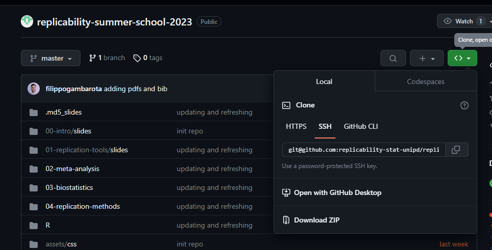

```{r, include = FALSE}
knitr::opts_chunk$set(
  collapse = TRUE,
  comment = "#>",
  fig.path = "man/figures/README-",
  out.width = "100%"
)

devtools::source_gist("c83e078bf8c81b035e32c3fc0cf04ee8",
                      filename = 'render_toc.R')
```

```{r, include = FALSE}
library(RefManageR)
library(kableExtra)
library(bib2df)
devtools::load_all()
```

```{r, include = FALSE}
bib <- RefManageR::ReadBib("papers/references.bib")
bib <- sort(bib)
files <- list.files("papers/pdfs/")
bib_df <- bib2df::bib2df("papers/references.bib")
df <- bib_df[, c("BIBTEXKEY", "AUTHOR")]
df$AUTHOR <- sapply(df$AUTHOR, function(x) x[[1]])
df <- df[order(df$AUTHOR), ]
df$file <- sort(files)

df$Authors <- sapply(df$BIBTEXKEY, function(x) Citet(bib, x))
#df$File <- sprintf("[pdf](%s)", file.path("papers/pdfs", df$file)) 
df$Title <- unname(unlist(bib$title))
df$Title <- sprintf('<a href="papers/pdfs/%s">%s</a>', df$file, df$Title)
df$Title <- gsub("\\{|\\}", "", df$Title)
df$Title <- gsub("\\n", "", df$Title)
```

# Contents

```{r toc, echo=FALSE} 
render_toc("README.Rmd")
```

# Information

This page contains the materials (slide, code, extra) used during the Summer School. For general information and official communications see the page [replicability.stat.unipd.it](https://replicability.stat.unipd.it/). This website is the web version of the bare Github repository that can be accessed here [github.com/replicability-stat-unipd/replicability-summer-school-2023](https://github.com/replicability-stat-unipd/replicability-summer-school-2023) or by pressing the `View on Github` button.

# Getting started

In this section are listed the software and packages required by the Summer School workshops. The elements marked with `#important` are necessary for the workshops. Other elements will be covered by during the workshops but are less relevant for the practical activities.

## Installing R and R Studio `#important`

### Installing R binaries `#important`

The first step is installing R that is a very straightforward process. You can go to <https://cran.r-project.org/>, download the installer for your operating system and follow the steps.

#### Additionals tools `#important`

For MAC users there is an additional tool that is required called `XQuartz` <https://www.xquartz.org/>.

For Windows users, `Rtools` <https://cran.r-project.org/bin/windows/Rtools/> is an additional tool required by some packages to works correctly. Remember to choose the version corresponding to the R version that you installed.

### R Studio `#important`

R Studio (now Posit) is an IDE to use the R programming language but also other programming languages. Is not the only option to use R (for hardcore users you can basically open a text editor and a terminal :skull:). Another very good option is VScode (which I personally use when writing using Quarto or R Markdown). However, I suggest you to install R Studio, you can download the last version from the website <https://posit.co/products/open-source/rstudio/>

## Quarto `#important`

Quarto is the evolution of R Markdown. Is a literate programming framework where prose (written in Markdown) can be combined with code (R, Python, Julia, etc.). This is an amazing tool to create report, presentations, papers etc. you can download it from <https://quarto.org/>.

## GIT

> Git is a free and open source distributed version control system designed to handle everything from small to very large projects with peed and efficiency.

Git is an extremely powerful tool to manage code-related projects (but not only). You can download it from the website <https://git-scm.com/>.

## Accounts

### Github

Github is the online server where Git repositories can be hosted. It is an amazing service where you can also create websites for free (where this page is hosted) just using R and Quarto (or R Markdown). You can create an account on the website <https://github.com/>.

To use Github and Git from the command line you can use `ssh` (to avoid typing the password for each operation). You can follow this guide [https://docs.github.com/en/authentication/connecting-to-github-with-ssh/adding-a-new-ssh-key-to-your-github-account?tool=webui&platform=linux](https://docs.github.com/en/authentication/connecting-to-github-with-ssh/adding-a-new-ssh-key-to-your-github-account?tool=webui&platform=linux).

### Open Science Framework

The Open Science Framework (OSF) is an free online repository to host documents, code and files related to research work. The repository can be shared and OSF will attach a DOI thus can be cited and shared in a consistent way. OSF can be linked to several other services such as reference managers, cloud storage and Github. You can create an account on the website <https://osf.io/>.

## R Packages `#important`

Beyond the base R installation we need extra packages for the workshops. In any case, R Studio will prompt you to install missing packages when detected from a script.

### CRAN Packages `#important`

To install packages from CRAN you can run the following code into the R console:

```r
pkgs <- c("tidyverse", "car", "devtools", "here", "knitr", "rmarkdown", "metafor", "MetaUtility", "pROC", "Replicate", "rstanarm", "sjPlot", "remotes", "cli", "logspline", "pwr", "ggdist")

install.packages(pkgs)
```

### Github Packages `#important`

There are some packages that are not available on CRAN. You can install using the following code:

```r
if (!require("remotes", quietly = TRUE)) install.packages("remotes")
gh_pkgs <- c("haozhu233/kableExtra", "filippogambarota/filor")
remotes::install_github(gh_pkgs)
```

### Bioconductor Packages `#important`

There are some packages from the `Bioconductor` repository. You can install using the following code.

```r
if (!require("BiocManager", quietly = TRUE)) install.packages("BiocManager")
BiocManager::install("curatedOvarianData")
```

# All packages

The packages indicated in the section above are the essential packages for the workshops. To reproduce the slides, plots and the overall project (not required to follow the workshops) there are extra packages. You can avoid installing it but this is a complete list:

```{r}
#| echo: false
all_pkgs <- get_project_packages()
all_pkgs |> 
    kable(format = "markdown")
```

# Repository

All the workshops materials are hosted in this repository. Once everything is installed, you can start working with the repository. I suggest you to download the entire folder. You can press the download button (see the image below).

<center>
{width="60%"}
</center>

If you want to use the `git` command-line (instead of manually downloading) you can use the following command with a terminal opened on the folder where you want the repository:

``` bash
git clone git@github.com:replicability-stat-unipd/replicability-summer-school-2023.git
```

Once downloaded, the project can be opened with `R Studio` simply opening the `replicability-summer-school-2023.Rproj` file.

The repository is organized as an R package, and the `devtools::load_all()` command mimic the `library()` behavior. In this way all the functions, data, etc. will be available in the R environment.

## Functions

Within slides and exercises we use some custom functions developed for the workshop. These functions can be loaded with `devtools::load_all()`:

- `R/utils.R`: general utilities for managing the project (not useful for the workshop)
- `R/utils-meta.R`: utilities for the meta-analysis workshop
- `R/utils-biostat.R`: utilities for the biostatistic workshop
- `R/utils-replication.R`: utilities for the replication methods workshop

Relevant functions are documented. You can see the documentation directly within the `R` files or using the standard syntax `?function` after using `devtools::load_all()` (for functions where the documentation is available).

## Useful links

- [Shared code editor](https://etherpad.wikimedia.org/p/replicability-summer-school-2023): the shared online notepad to write code together.

# Materials

## Slides

The slides are located into the specific folders. Then when relevant `script/` and `objects/` folders contains extra documents and files used in the slides and for exercises. You can directly open the slides clicking on `html` or accessing the source code with `qmd`.

```{r, results="asis", echo=FALSE}
slides <- data.frame(
  stringsAsFactors = FALSE,
               Day = c("09-18-2023","09-18-2023",
                       "09-19-2023","09-20-2023","09-21-2023"),
             Title = c("**Introduction to the workshops**","**Tools for reproducible research**",
                       "**Meta-Analysis and Multi-Lab Replication studies**",
                       "**Exploring Replicability in Biostatistics**",
                       "**Statistical Methods for Replication Assessment**"),
            Slides = c("[html](00-intro/slides/00-intro.html)",
                       "[html](01-replication-tools/slides/01-replication-tools.html)",
                       "[html](02-meta-analysis/slides/02-meta-analysis.html)",
                       "[html](03-biostatistics/slides/03-biostatistics.html)",
                       "[html](04-replication-methods/slides/04-replication-methods.html)"),
            Source = c("[qmd](00-intro/slides/00-intro.qmd)",
                       "[qmd](01-replication-tools/slides/01-replication-tools.qmd)",
                       "[qmd](02-meta-analysis/slides/02-meta-analysis.qmd)",
                       "[qmd](03-biostatistics/slides/03-biostatistics.qmd)",
                       "[qmd](04-replication-methods/slides/04-replication-methods.html)"),
         Solutions = c(NA,NA,
                       "[html](02-meta-analysis/slides/02-meta-analysis-solutions.html) - [qmd](02-meta-analysis/slides/02-meta-analysis-solutions.qmd)",
                       "[html](03-biostatistics/slides/03-biostatistics-solutions.html) - [qmd](03-biostatistics/slides/03-biostatistics-solutions.qmd)",NA)
)

slides[is.na(slides)] <- ""

if(!params$solutions){
    slides <- slides[, -5]
}

slides |> 
    kable(format = "markdown")
```

## Data

The dataset used in the slides and for exercises are contained into the specific workshop folder (e.g., `02-meta-analysis/objects/`) and into the `data/` folder. To load a dataset you can manually import using `readRDS()` or using the `data()` function after loading the package with `devtools::load_all()`. For example:

```{r}
#| echo: false
temp <- new.env()
temp$dat <- readRDS("02-meta-analysis/objects/dear2019.rds")
data("dear2019", envir = temp)
ls <- function() base::ls(envir = temp)
```


```{r}
dat <- readRDS("02-meta-analysis/objects/dear2019.rds")
devtools::load_all()
data("dear2019")
ls()
```

```{r, child="files/teamwork.Rmd", eval=params$teamwork}
```